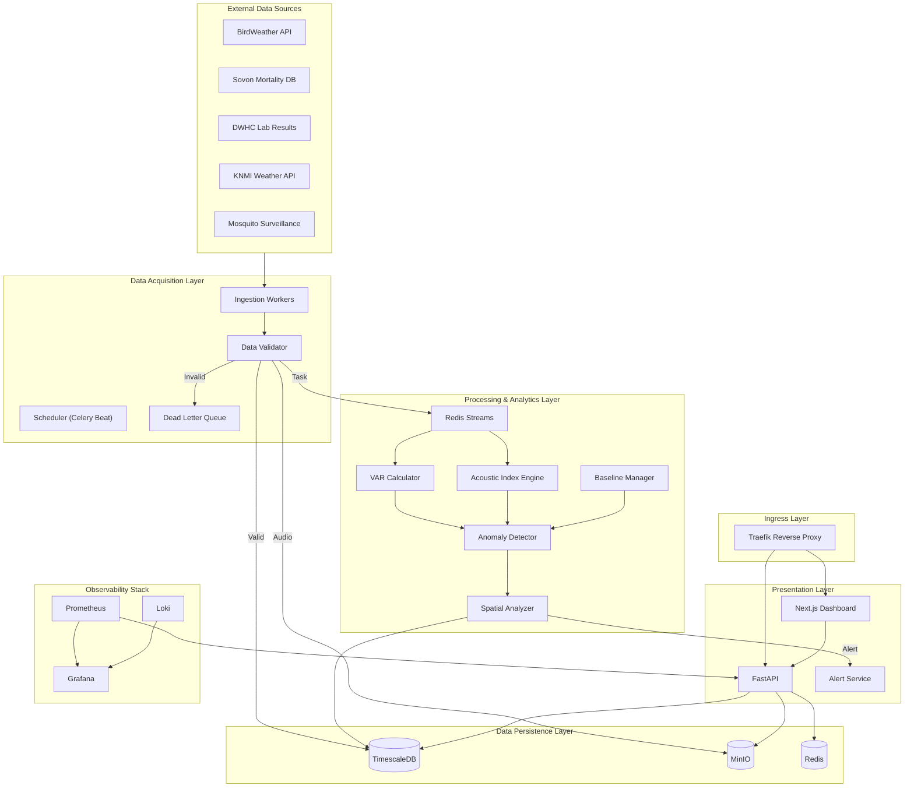
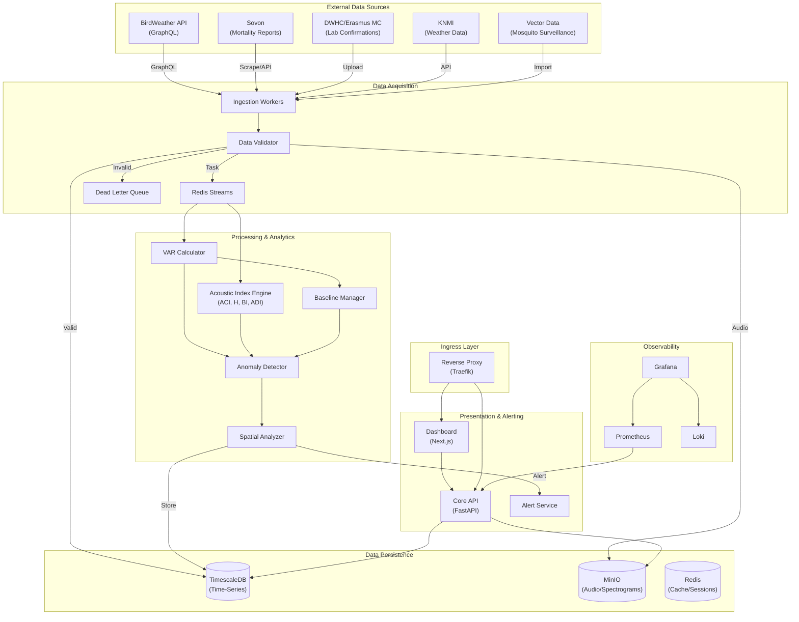
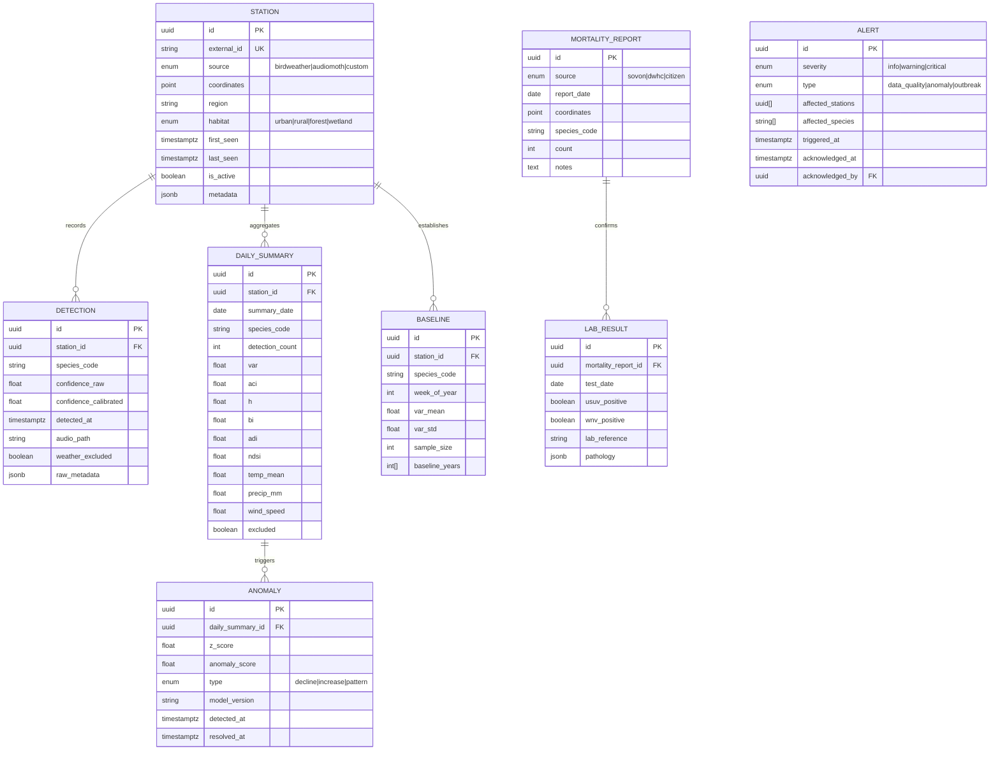
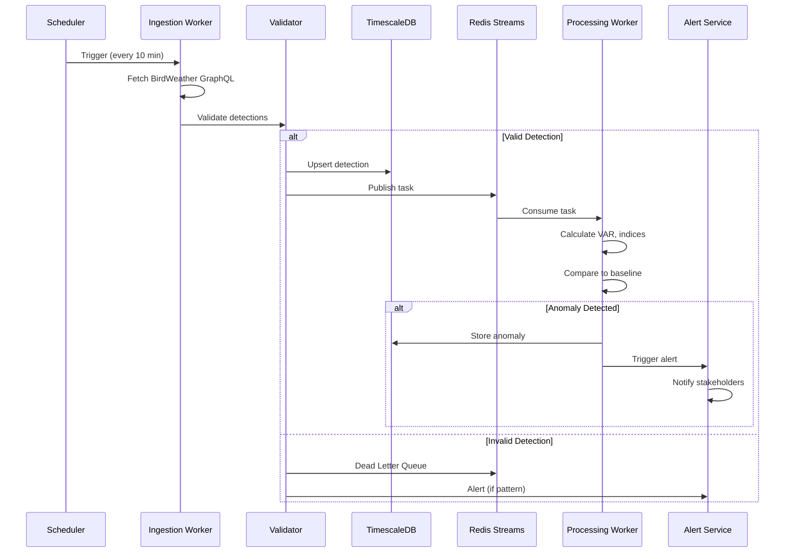
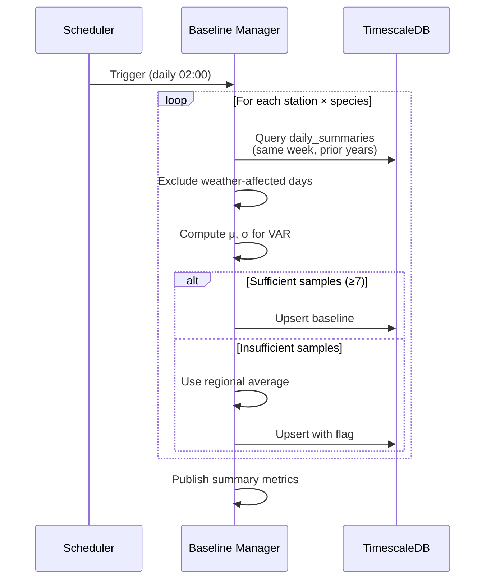
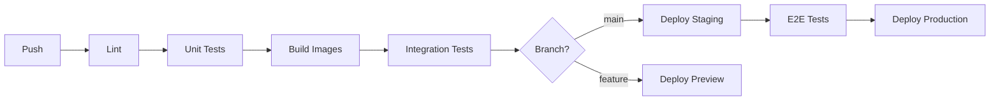

# System Design Document: Avian Biosurveillance Platform

**Version**: 2.0  
**Last Updated**: 2026-01-29  
**Status**: Draft  
**Owner**: Avian Biosurveillance Research Team  

---

## Table of Contents

1. [Executive Summary](#1-executive-summary)
2. [Service Level Objectives](#2-service-level-objectives)
3. [System Architecture](#3-system-architecture)
4. [Data Model](#4-data-model)
5. [Core Components](#5-core-components)
6. [Data Flow & Processing](#6-data-flow--processing)
7. [API Design](#7-api-design)
8. [Deployment Architecture](#8-deployment-architecture)
9. [Security & Compliance](#9-security--compliance)
10. [Observability](#10-observability)
11. [Disaster Recovery](#11-disaster-recovery)
12. [Testing Strategy](#12-testing-strategy)
13. [Performance & Scalability](#13-performance--scalability)
14. [Cost Analysis](#14-cost-analysis)
15. [Operational Runbooks](#15-operational-runbooks)
16. [Architectural Decision Records](#16-architectural-decision-records)
17. [Research Validation Framework](#17-research-validation-framework)
18. [Appendices](#appendices)

---

## 1. Executive Summary

### 1.1 Problem Statement

Traditional avian disease surveillance relies on passive mortality reporting and laboratory testing—approaches that detect outbreaks only after significant population impacts have occurred. This system explores whether **passive acoustic monitoring (PAM)** can provide earlier detection of arboviral outbreaks through real-time analysis of bird vocalization patterns.

> [!IMPORTANT]
> **Critical Research Gap**: No validated acoustic biosurveillance systems exist for arboviral diseases in wild birds. This platform is designed for **rigorous hypothesis testing** before becoming operational.

### 1.2 Solution Overview

The Avian Biosurveillance Platform is a research-grade early warning system that:

- **Ingests** acoustic detection data from BirdWeather stations and correlates with mortality reports
- **Analyzes** Vocal Activity Rates (VAR) and acoustic indices against multi-year baselines
- **Detects** anomalies suggesting population-level changes in target species
- **Validates** acoustic signals against confirmed USUV (Usutu virus) cases

### 1.3 Target Species & Geography

| Parameter | Value |
|-----------|-------|
| **Primary Species** | Eurasian Blackbird (*Turdus merula*) |
| **Secondary Species** | Song Thrush, European Greenfinch, Common Magpie |
| **Geographic Scope** | Netherlands (Phase 1), Northwest Europe (Phase 2) |
| **Pathogen Focus** | Usutu virus (USUV), with extensibility for WNV |

### 1.4 Stakeholder Matrix (RACI)

| Stakeholder | Role | Responsible | Accountable | Consulted | Informed |
|-------------|------|:-----------:|:-----------:|:---------:|:--------:|
| Research Team | System development & hypothesis testing | R | A | | |
| DWHC | Lab confirmations, pathology data | | | C | I |
| Sovon | Mortality reporting, citizen science | | | C | I |
| Erasmus MC | Virology expertise, serology | | | C | I |
| Wildlife Health Authorities | Policy response | | | | I |
| BirdWeather | Data provider | | | C | I |

### 1.5 Success Criteria

| Metric | Target | Measurement |
|--------|--------|-------------|
| **Baseline Coverage** | ≥50 stations with 2+ years data | Station count in DB |
| **Detection Latency** | <30 min from ingestion to alert | E2E pipeline timing |
| **Hypothesis Validation** | Statistical evidence for/against H1-H4 | Peer-reviewed publication |
| **False Positive Rate** | <30% of alerts without outbreak | Retrospective analysis |
| **Lead Time** | ≥7 days before mortality peak | Correlation analysis |

---

## 2. Service Level Objectives

### 2.1 Availability

| Service | SLO | Error Budget (Monthly) | Measurement |
|---------|-----|------------------------|-------------|
| **Data Ingestion Pipeline** | 99.5% | 3.6 hours | Successful job completion rate |
| **Core API** | 99.9% | 43 minutes | HTTP 2xx response rate |
| **Dashboard** | 99.5% | 3.6 hours | Page load success rate |
| **Alert Delivery** | 99.9% | 43 minutes | Alert acknowledgment within 5 min |

### 2.2 Latency

| Operation | p50 | p95 | p99 |
|-----------|-----|-----|-----|
| API - List stations | <100ms | <300ms | <500ms |
| API - Get detections (24h) | <200ms | <500ms | <1s |
| API - Anomaly query | <300ms | <800ms | <1.5s |
| Dashboard - Initial load | <1s | <2s | <3s |
| Detection-to-Alert Pipeline | <5min | <15min | <30min |

### 2.3 Data Freshness

| Data Source | Freshness Target | Acceptable Lag |
|-------------|------------------|----------------|
| BirdWeather detections | <1 hour | <4 hours |
| Weather data (KNMI) | <2 hours | <6 hours |
| Mortality reports (Sovon) | <24 hours | <48 hours |
| Lab confirmations (DWHC) | <48 hours | <7 days |

### 2.4 Alerting Thresholds

| Condition | Alert | Escalation |
|-----------|-------|------------|
| SLO breach >50% error budget consumed | Warning | Email to on-call |
| SLO breach >80% error budget consumed | Critical | PagerDuty + Slack |
| Data ingestion failure >2 hours | Critical | PagerDuty |
| No detections from >30% stations for >4h | Warning | Email to on-call |

---

## 3. System Architecture

### 3.1 High-Level Architecture

The system follows an **Event-Driven Architecture (EDA)** with three logical tiers:



Previous:



### 3.2 Design Principles

| Principle | Implementation |
|-----------|----------------|
| **Research-First** | Every component supports hypothesis testing and validation |
| **Multi-Modal Integration** | Acoustic + Mortality + Vector + Environmental data streams |
| **Reproducibility** | All analyses versioned with model parameters stored |
| **Graceful Degradation** | System useful even with partial data availability |
| **Defense in Depth** | Multiple security layers, network isolation |
| **Observability** | Comprehensive metrics, logging, and tracing |

### 3.3 Component Inventory

| Component | Technology | Version | Purpose |
|-----------|------------|---------|---------|
| Reverse Proxy | Traefik | 3.0 | TLS termination, routing |
| API Server | FastAPI | 0.109+ | REST API, OpenAPI |
| Web Dashboard | Next.js | 14+ | SSR UI |
| Task Queue | Celery + Redis | 5.3+ | Async job processing |
| Time-Series DB | TimescaleDB | 2.14+ | Detection storage |
| Object Storage | MinIO | Latest | Audio/spectrogram storage |
| Cache | Redis | 7+ | Session, cache, streams |
| Metrics | Prometheus | 2.48+ | Metric collection |
| Dashboards | Grafana | 10+ | Visualization |
| Logs | Loki | 2.9+ | Log aggregation |

---

## 4. Data Model

### 4.1 Entity Relationship Diagram



### 4.2 Species Configuration

Species-specific BirdNET confidence thresholds (calibrated per Wood & Kahl 2024):

| Species | Code | Raw Threshold | Calibrated pr(TP) | Priority |
|---------|------|---------------|-------------------|----------|
| Eurasian Blackbird | EURBLA | 0.65 | ≥0.90 | Primary |
| Song Thrush | SONTHR | 0.70 | ≥0.90 | Secondary |
| European Greenfinch | EURGRE | 0.60 | ≥0.85 | Tertiary |
| Common Magpie | COMMAG | 0.55 | ≥0.85 | Tertiary |

> [!NOTE]
> Thresholds require local calibration using 50-200 manually validated predictions per species. Values shown are initial estimates.

### 4.3 TimescaleDB Configuration

| Hypertable | Chunk Interval | Retention | Compression | Continuous Aggregates |
|------------|----------------|-----------|-------------|----------------------|
| `detections` | 1 day | Indefinite | After 90 days | Hourly/daily counts |
| `daily_summaries` | 1 week | Indefinite | After 1 year | Weekly trends |
| `acoustic_indices` | 1 day | 2 years | After 30 days | Daily medians |
| `anomalies` | 1 week | Indefinite | None | None |

---

## 5. Core Components

### 5.1 Data Acquisition Layer

#### 5.1.1 Source Adapters

| Source | Protocol | Frequency | Data Type | Priority |
|--------|----------|-----------|-----------|----------|
| BirdWeather | GraphQL | 10 min | Detections + Audio | P0 |
| KNMI | REST | 1 hour | Weather | P0 |
| Sovon | Scrape/CSV | Daily | Mortality | P1 |
| DWHC | Manual Upload | Ad-hoc | Lab Results | P1 |
| Vector Surveillance | Import | Weekly | Mosquito Data | P2 |

#### 5.1.2 Data Validation Rules

```python
VALIDATION_SCHEMA = {
    "detection": {
        "required": ["station_id", "species", "timestamp", "confidence"],
        "geo_bounds": {"lat": (50.5, 53.7), "lon": (3.2, 7.3)},  # NL
        "confidence_range": (0.01, 1.0),
        "max_age_hours": 168,
    },
    "mortality": {
        "required": ["date", "location", "species"],
        "date_range": ("2016-01-01", "today"),
        "species_whitelist": "USUV_SUSCEPTIBLE_SPECIES",
    },
}

WEATHER_EXCLUSIONS = {
    "precipitation_mm_hr": ">10",   # Heavy rain
    "wind_speed_kmh": ">20",        # High wind
    "post_deployment_hours": 48,    # Habituation period
}
```

### 5.2 Processing Layer

#### 5.2.1 Vocal Activity Rate (VAR) Calculator

```
VAR = (detections ≥ species_threshold) / recording_hours
```

| Aggregation | Use Case | Window |
|-------------|----------|--------|
| Hourly | Diel pattern analysis | 1 hour |
| Daily | Primary analysis unit | 24 hours |
| Weekly | Trend detection | 7 days rolling |

#### 5.2.2 Acoustic Index Engine

Computes soundscape indices using `scikit-maad`:

| Index | Description | Frequency Range |
|-------|-------------|-----------------|
| ACI | Acoustic Complexity Index | 0-15 kHz |
| H | Acoustic Entropy | 0-15 kHz |
| BI | Bioacoustic Index | 2-8 kHz |
| ADI | Acoustic Diversity Index | All bands |
| NDSI | Normalized Difference Soundscape Index | Bio/Anthro |

#### 5.2.3 Anomaly Detection

**Tiered Alert System:**

| Level | Condition | Action |
|-------|-----------|--------|
| **Normal** | VAR within μ ± 2σ | None |
| **Advisory** | VAR decline 20-30% | Log, dashboard flag |
| **Warning** | VAR decline 30-50% OR ≥3 stations in 20km | Email notification |
| **Critical** | VAR decline >50% + confirmed mortality | Immediate alert |

**Multi-Factor Scoring Algorithm:**

```python
def compute_anomaly_score(station, regional, mortality) -> tuple[float, list[str]]:
    """Combine acoustic, spatial, and epidemiological signals."""
    score, factors = 0.0, []
    
    # Acoustic decline weight: 30%
    if station.var_zscore < -2:
        score += 30
        factors.append(f"VAR decline: {station.var_zscore:.1f}σ")
    
    # Spatial correlation weight: 25%
    if regional.stations_declining >= 3:
        score += 25
        factors.append(f"{regional.stations_declining} nearby stations declining")
    
    # Mortality correlation weight: 40%
    if mortality.confirmed_usuv_30d:
        score += 40
        factors.append("Confirmed USUV in region")
    elif mortality.unconfirmed_deaths > 5:
        score += 15
        factors.append(f"{mortality.unconfirmed_deaths} unconfirmed deaths")
    
    # Seasonal multiplier (Aug-Sep peak)
    if station.date.month in (8, 9):
        score *= 1.2
        factors.append("Peak transmission season")
    
    return min(score, 100), factors
```

---

## 6. Data Flow & Processing

### 6.1 Real-Time Ingestion Flow



### 6.2 Baseline Computation Flow



---

## 7. API Design

### 7.1 API Versioning Strategy

| Aspect | Approach |
|--------|----------|
| Versioning | URL path prefix (`/api/v1/`) |
| Breaking Changes | New major version, 6-month deprecation |
| Authentication | Bearer tokens (JWT) |
| Rate Limiting | 100 req/min per client |
| Documentation | OpenAPI 3.1 at `/api/docs` |

### 7.2 Core Endpoints

| Endpoint | Method | Description | Auth |
|----------|--------|-------------|------|
| `/api/v1/stations` | GET | List stations with status | API Key |
| `/api/v1/stations/{id}` | GET | Station details | API Key |
| `/api/v1/stations/{id}/detections` | GET | Detections (paginated) | API Key |
| `/api/v1/stations/{id}/summary` | GET | Daily summaries | API Key |
| `/api/v1/baselines/{station}/{species}` | GET | Baseline data | API Key |
| `/api/v1/anomalies` | GET | Active anomalies | API Key |
| `/api/v1/anomalies/{id}` | GET | Anomaly details | API Key |
| `/api/v1/anomalies/{id}/acknowledge` | POST | Acknowledge alert | JWT |
| `/api/v1/mortality` | GET | Mortality reports | API Key |
| `/api/v1/export` | POST | Request data export | JWT |
| `/api/v1/health` | GET | Health check | None |
| `/api/v1/metrics` | GET | Prometheus metrics | Internal |

### 7.3 Request/Response Examples

**GET /api/v1/stations/{id}/summary**

```json
{
  "station_id": "uuid",
  "species": "EURBLA",
  "date_range": {"start": "2026-01-01", "end": "2026-01-28"},
  "summaries": [
    {
      "date": "2026-01-28",
      "detection_count": 47,
      "var": 2.35,
      "var_baseline": 3.12,
      "var_zscore": -1.8,
      "aci": 145.2,
      "h": 0.82,
      "weather_excluded": false
    }
  ]
}
```

---

## 8. Deployment Architecture

### 8.1 Container Topology

```yaml
services:
  # === Ingress ===
  traefik:
    image: traefik:v3.0
    ports: ["443:443", "80:80"]
    deploy:
      replicas: 1
      resources: {limits: {cpus: "0.5", memory: 256M}}

  # === Application ===
  api:
    image: avian-biosurv/api:${TAG}
    deploy:
      replicas: 2
      resources: {limits: {cpus: "1", memory: 1G}}
    depends_on: [timescaledb, redis]
    healthcheck:
      test: ["CMD", "curl", "-f", "http://localhost:8000/api/v1/health"]
      interval: 30s

  web:
    image: avian-biosurv/web:${TAG}
    deploy:
      replicas: 1
      resources: {limits: {cpus: "0.5", memory: 512M}}
    depends_on: [api]

  # === Ingestion ===
  ingest-birdweather:
    image: avian-biosurv/ingest:${TAG}
    command: ["birdweather"]
    deploy:
      replicas: 1
      resources: {limits: {cpus: "1", memory: 1G}}

  ingest-sovon:
    image: avian-biosurv/ingest:${TAG}
    command: ["sovon"]
    deploy:
      replicas: 1
      resources: {limits: {cpus: "0.5", memory: 512M}}

  # === Processing ===
  worker-var:
    image: avian-biosurv/worker:${TAG}
    command: ["var"]
    deploy:
      replicas: 2
      resources: {limits: {cpus: "1", memory: 2G}}

  worker-anomaly:
    image: avian-biosurv/worker:${TAG}
    command: ["anomaly"]
    deploy:
      replicas: 1
      resources: {limits: {cpus: "0.5", memory: 1G}}

  alert-service:
    image: avian-biosurv/alert:${TAG}
    deploy:
      replicas: 1
      resources: {limits: {cpus: "0.25", memory: 256M}}

  # === Data Stores ===
  timescaledb:
    image: timescale/timescaledb:latest-pg15
    deploy:
      resources: {limits: {cpus: "2", memory: 4G}}
    volumes: [timescale_data:/var/lib/postgresql/data]

  redis:
    image: redis:7-alpine
    command: ["redis-server", "--appendonly", "yes"]
    deploy:
      resources: {limits: {cpus: "0.5", memory: 1G}}
    volumes: [redis_data:/data]

  minio:
    image: minio/minio:latest
    deploy:
      resources: {limits: {cpus: "1", memory: 1G}}
    volumes: [minio_data:/data]

  # === Observability ===
  prometheus:
    image: prom/prometheus:latest
  grafana:
    image: grafana/grafana:latest
  loki:
    image: grafana/loki:latest
```

### 8.2 Resource Summary

| Category | CPU Cores | Memory | Storage |
|----------|-----------|--------|---------|
| Application | 4.75 | 6.5 GB | - |
| Data Stores | 3.5 | 6 GB | 600+ GB |
| Observability | 1.5 | 2 GB | 50 GB |
| **Total** | **9.75** | **14.5 GB** | **650+ GB** |

### 8.3 Network Architecture

```
┌──────────────────────────────────────────────────────────┐
│                    Public Internet                        │
│                           │                               │
│                    ┌──────┴──────┐                        │
│                    │   Traefik   │ (TLS, Port 443)        │
│                    └──────┬──────┘                        │
│  ════════════════════════╧════════════════════════════   │
│                   Application Network                     │
│   ┌─────┐  ┌─────┐  ┌─────────┐  ┌──────────────┐        │
│   │ Web │  │ API │  │ Workers │  │ Alert Service│        │
│   └──┬──┘  └──┬──┘  └────┬────┘  └──────┬───────┘        │
│  ════╧════════╧══════════╧══════════════╧════════════    │
│                   Database Network                        │
│   ┌─────────────┐  ┌───────┐  ┌───────┐                  │
│   │ TimescaleDB │  │ Redis │  │ MinIO │                  │
│   └─────────────┘  └───────┘  └───────┘                  │
└──────────────────────────────────────────────────────────┘
```

---

## 9. Security & Compliance

### 9.1 Security Controls

| Layer | Control | Implementation |
|-------|---------|----------------|
| **Network** | TLS 1.3 | Traefik auto-cert |
| **Network** | Network isolation | Docker networks |
| **Authentication** | JWT + OAuth2 | Dashboard login |
| **Authentication** | API keys | Service-to-service |
| **Authorization** | RBAC | Admin, Researcher, Viewer |
| **Secrets** | Encrypted at rest | Docker secrets / K8s |
| **Audit** | Request logging | Loki + structured logs |

### 9.2 Secret Management

| Secret | Storage | Access Scope |
|--------|---------|--------------|
| `BIRDWEATHER_TOKEN` | Secrets manager | Ingest workers |
| `DATABASE_URL` | Secrets manager | API, Workers |
| `MINIO_ACCESS_KEY` | Secrets manager | API, Ingest |
| `JWT_SECRET` | Secrets manager | API only |
| `SMTP_PASSWORD` | Secrets manager | Alert service |

### 9.3 Data Privacy & GDPR

| Aspect | Approach |
|--------|----------|
| **Data Minimization** | Only collect data necessary for research |
| **Retention** | Defined per data type (see §4.3) |
| **Access Control** | Role-based, audit logged |
| **Data Subject Rights** | N/A (no personal data in scope) |
| **Third-Party Data** | BirdWeather ToS compliance |

---

## 10. Observability

### 10.1 Metrics (Prometheus)

**System Metrics:**
- Container CPU/Memory utilization
- API request latency (p50, p95, p99)
- Queue depth and consumer lag
- Error rates by service

**Application Metrics:**
- `ingestion_detections_total` - Detections ingested
- `var_calculations_total` - VAR computations
- `anomalies_detected_total` - Anomalies triggered
- `alerts_sent_total` - Alerts dispatched

**Data Quality Metrics:**
- `stations_active_count` - Stations reporting
- `detection_confidence_histogram` - Score distribution
- `validation_failures_total` - Invalid records
- `data_freshness_seconds` - Lag per source

### 10.2 Dashboards (Grafana)

| Dashboard | Purpose |
|-----------|---------|
| **System Health** | CPU, Memory, Disk, Network |
| **Data Pipeline** | Ingestion throughput, latency, errors |
| **Acoustic Activity** | VAR trends, species distribution |
| **Anomaly Overview** | Active alerts, timeline |
| **Outbreak Correlation** | Acoustic vs. mortality overlay |

### 10.3 Logging (Loki)

| Log Level | Use Case | Retention |
|-----------|----------|-----------|
| ERROR | Exceptions, failures | 90 days |
| WARN | Degraded operations | 30 days |
| INFO | Request/response, job completion | 14 days |
| DEBUG | Detailed diagnostics | 7 days |

---

## 11. Disaster Recovery

### 11.1 RPO/RTO Targets

| Component | RPO | RTO | Strategy |
|-----------|-----|-----|----------|
| TimescaleDB | 1 hour | 4 hours | pg_dump + WAL archiving |
| MinIO (Audio) | 24 hours | 8 hours | rsync to backup storage |
| Redis | 24 hours | 1 hour | AOF persistence, rebuild |
| Configuration | 0 | 30 min | GitOps (version controlled) |

### 11.2 Backup Strategy

| Data | Method | Frequency | Retention | Location |
|------|--------|-----------|-----------|----------|
| PostgreSQL | pg_dump | Daily | 30 days | Off-site storage |
| PostgreSQL WAL | Continuous archiving | Real-time | 7 days | Off-site storage |
| Audio files | rsync | Daily | Indefinite | Off-site storage |
| Grafana configs | JSON export | Weekly | 90 days | Git repository |

### 11.3 Recovery Procedures

1. **Database Recovery**: Restore from pg_dump + replay WAL
2. **Audio Recovery**: rsync from backup storage
3. **Service Recovery**: Docker Compose up with versioned images
4. **Configuration**: Pull from Git, apply secrets

### 11.4 Failover Testing

| Test | Frequency | Procedure |
|------|-----------|-----------|
| Backup restoration | Quarterly | Restore to staging, validate |
| Service restart | Monthly | Rolling restart, verify health |
| Data integrity | Weekly | Automated checksums |

---

## 12. Testing Strategy

### 12.1 Test Pyramid

| Level | Coverage Target | Tools |
|-------|-----------------|-------|
| **Unit** | 80% | pytest, Jest |
| **Integration** | Key paths | pytest, testcontainers |
| **E2E** | Critical flows | Playwright |
| **Load** | SLO validation | Locust, k6 |

### 12.2 Test Scenarios

**Unit Tests:**
- VAR calculation with edge cases
- Anomaly score computation
- Data validation rules
- Baseline algorithms

**Integration Tests:**
- BirdWeather API ingestion flow
- Database CRUD operations
- Redis queue processing
- Alert delivery

**E2E Tests:**
- Dashboard login and navigation
- Anomaly acknowledgment workflow
- Data export functionality
- API authentication

### 12.3 CI/CD Pipeline



| Stage | Trigger | Environment |
|-------|---------|-------------|
| Lint + Unit | Every push | CI runner |
| Integration | PR + main | Testcontainers |
| Staging | main merge | Staging cluster |
| Production | Manual approval | Production cluster |

---

## 13. Performance & Scalability

### 13.1 Capacity Planning

| Metric | Current | Year 1 | Year 3 |
|--------|---------|--------|--------|
| Stations | 50 | 150 | 500 |
| Detections/day | 10,000 | 50,000 | 200,000 |
| Audio storage | 50 GB | 500 GB | 2 TB |
| API requests/day | 5,000 | 25,000 | 100,000 |

### 13.2 Scaling Strategy

| Component | Scaling Type | Trigger |
|-----------|--------------|---------|
| API | Horizontal | CPU >70% for 5 min |
| Workers | Horizontal | Queue depth >500 |
| TimescaleDB | Vertical | Storage >80% |
| MinIO | Horizontal | Storage >80% |

### 13.3 Performance Benchmarks

| Operation | Target | Measured |
|-----------|--------|----------|
| Ingest 1000 detections | <30s | TBD |
| Compute daily VAR (50 stations) | <60s | TBD |
| Anomaly detection cycle | <5 min | TBD |
| Dashboard initial load | <2s | TBD |

---

## 14. Cost Analysis

### 14.1 Infrastructure Costs (Monthly)

| Category | Resource | Estimated Cost |
|----------|----------|----------------|
| **Compute** | 10 vCPU, 16GB RAM | €150-200 |
| **Storage** | 1TB SSD | €50-80 |
| **Network** | Egress ~100GB | €10-20 |
| **Backup** | Off-site 500GB | €20-30 |
| **Monitoring** | Grafana Cloud (optional) | €0-50 |
| **Total** | | **€230-380/month** |

### 14.2 Cost Optimization

| Strategy | Savings Potential |
|----------|-------------------|
| Compression (TimescaleDB) | 60-80% storage |
| Audio transcoding | 50% storage |
| Reserved instances | 30-40% compute |
| Tiered storage | 20% storage |

---

## 15. Operational Runbooks

### 15.1 Common Incidents

#### Incident: No detections for >4 hours

1. **Check** BirdWeather API status
2. **Verify** ingestion worker health: `docker logs ingest-birdweather`
3. **Check** Redis connectivity
4. **Escalate** if external API down

#### Incident: High anomaly false positive rate

1. **Review** recent weather conditions
2. **Check** baseline sample sizes
3. **Adjust** threshold parameters if needed
4. **Document** in post-mortem

#### Incident: Database slow queries

1. **Identify** slow queries via `pg_stat_statements`
2. **Check** index usage with `EXPLAIN ANALYZE`
3. **Verify** continuous aggregates are current
4. **Scale** resources if needed

### 15.2 On-Call Rotation

| Tier | Scope | Response Time |
|------|-------|---------------|
| L1 | Data pipeline | 30 min |
| L2 | Application issues | 1 hour |
| L3 | Infrastructure | 4 hours |

---

## 16. Architectural Decision Records

### ADR-001: TimescaleDB for Time-Series Storage

| Aspect | Details |
|--------|---------|
| **Status** | Accepted |
| **Context** | Need to store millions of detection records with time-based queries |
| **Decision** | Use TimescaleDB over InfluxDB or vanilla PostgreSQL |
| **Rationale** | Native PostgreSQL compatibility, SQL familiarity, continuous aggregates, compression |
| **Consequences** | Requires PostgreSQL expertise; hypertable design upfront |

### ADR-002: Redis Streams over Kafka

| Aspect | Details |
|--------|---------|
| **Status** | Accepted |
| **Context** | Need message queue for async processing |
| **Decision** | Use Redis Streams instead of Kafka or RabbitMQ |
| **Rationale** | Simpler operations, sufficient throughput (<10K msg/min), already using Redis |
| **Consequences** | Limited replay capability; reconsider at 100K+ messages/day |

### ADR-003: MinIO for Object Storage

| Aspect | Details |
|--------|---------|
| **Status** | Accepted |
| **Context** | Store audio files and spectrograms |
| **Decision** | Use MinIO (S3-compatible) on-premises |
| **Rationale** | S3 API compatibility, self-hosted, no cloud dependency |
| **Consequences** | Requires backup strategy; consider cloud S3 for DR |

### ADR-004: Next.js for Dashboard

| Aspect | Details |
|--------|---------|
| **Status** | Accepted |
| **Context** | Need interactive dashboard with maps and charts |
| **Decision** | Use Next.js over React SPA or Vue |
| **Rationale** | SSR for initial load, built-in API routes, strong ecosystem |
| **Consequences** | Node.js dependency; more complex than static SPA |

---

## 17. Research Validation Framework

### 17.1 Hypotheses Under Test

| ID | Hypothesis | Key Metrics | Visualization |
|----|------------|-------------|---------------|
| H1 | Reduced Detection Rates | Daily count, VAR trend | Time series + baseline |
| H2 | Altered Vocal Activity | VAR change vs. mortality lag | Lead-lag correlation |
| H3 | Community-Level Changes | ACI, H, BI trends | Multi-index dashboard |
| H4 | Spatial Correlation | Decline clusters vs. USUV spread | Animated map |

### 17.2 Validation Checklist

Before operational deployment:

- [ ] **Baseline established**: ≥2 years VAR data for primary stations
- [ ] **Thresholds calibrated**: 50-200 samples per species validated
- [ ] **H1 tested**: Documented VAR-population correlation
- [ ] **H2 tested**: Lead time of acoustic decline measured
- [ ] **False positive rate**: <30% alerts without outbreak
- [ ] **Specificity validated**: Disease vs. weather/seasonal distinguished
- [ ] **Publication**: Peer-reviewed results (accept null results)

> [!CAUTION]
> Until validation complete, all alerts are **research hypotheses** requiring traditional surveillance confirmation.

---

## Appendices

### Appendix A: Technology Stack Summary

| Layer | Technology | Purpose |
|-------|------------|---------|
| Ingress | Traefik 3.0 | Reverse proxy, TLS |
| API | FastAPI | REST API |
| Web | Next.js 14 | Dashboard |
| Queue | Celery + Redis | Task processing |
| Time-Series | TimescaleDB | Detection storage |
| Object | MinIO | Audio storage |
| Cache | Redis 7 | Cache, sessions |
| Metrics | Prometheus | Metric collection |
| Logs | Loki | Log aggregation |
| Dashboards | Grafana | Visualization |
| Acoustic | scikit-maad | Index computation |

### Appendix B: Glossary

| Term | Definition |
|------|------------|
| **ARU** | Autonomous Recording Unit |
| **PAM** | Passive Acoustic Monitoring |
| **VAR** | Vocal Activity Rate (detections/hour) |
| **USUV** | Usutu Virus |
| **ACI** | Acoustic Complexity Index |
| **BirdNET** | Deep learning species classifier |
| **SLO** | Service Level Objective |
| **RPO** | Recovery Point Objective |
| **RTO** | Recovery Time Objective |

### Appendix C: References

- [BirdNET Algorithm](https://www.sciencedirect.com/science/article/pii/S1574954121000273)
- [BirdNET Score Guidelines (Wood & Kahl 2024)](https://connormwood.com/wp-content/uploads/2024/02/wood-kahl-2024-guidelines-for-birdnet-scores.pdf)
- [USUV Netherlands Surveillance (Nature Communications 2025)](https://www.nature.com/articles/s41467-025-63122-w)
- [DWHC Mortality Reports](https://dwhc.nl/en/2024/09/once-again-an-increased-mortality-of-common-blackbirds/)
- [scikit-maad Documentation](https://scikit-maad.github.io/)

---

**Document History**

| Version | Date | Author | Changes |
|---------|------|--------|---------|
| 1.0 | 2026-01 | Research Team | Initial draft |
| 2.0 | 2026-01-29 | Research Team | Added SLOs, DR, ADRs, testing, cost analysis |
